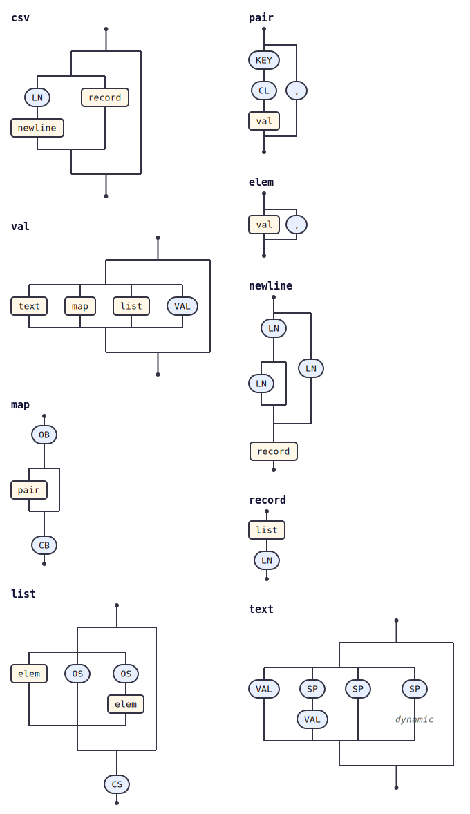

# @tabnas/csv

This plugin allows the [Jsonic](https://jsonic.senecajs.org) JSON parser to support csv syntax.

This repository contains:

| Path | Description |
|---|---|
| [`ts/`](ts/) | TypeScript / JavaScript implementation. |
| [`go/`](go/) | Go port. |
| [`test/fixtures/`](test/fixtures/) | Shared conformance fixtures, exercised by both runtimes. |

See [`ts/README.md`](ts/README.md) for usage.

## Grammar

The grammar is defined once in the top-level
[`csv-grammar.jsonic`](csv-grammar.jsonic) and embedded into both the
TypeScript ([`ts/src/csv.ts`](ts/src/csv.ts)) and Go
([`go/csv.go`](go/csv.go)) implementations by
[`ts/embed-grammar.js`](ts/embed-grammar.js) (run as part of `npm run build`).

## Grammar diagram

The grammar as a railroad/syntax diagram, generated from the live grammar
with [`@tabnas/railroad`](https://github.com/tabnas/railroad):

ASCII version: [`ts/doc/grammar.txt`](ts/doc/grammar.txt).

## License

MIT. Copyright (c) Richard Rodger.
