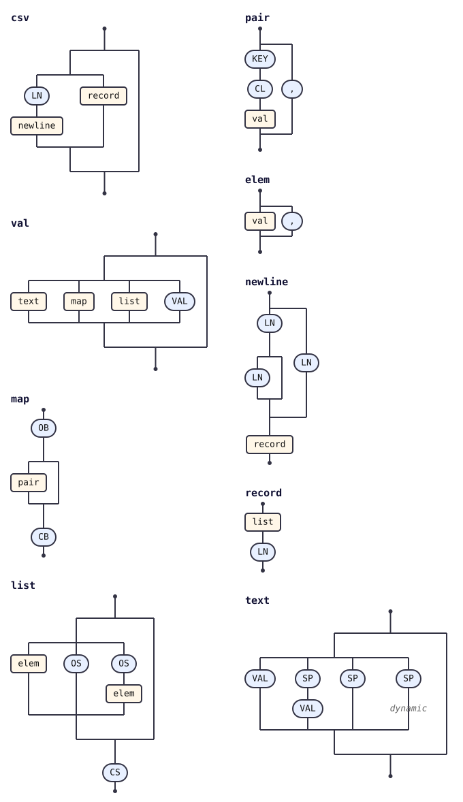

# @tabnas/csv

<!-- tabnas-badges -->
[](https://www.npmjs.com/package/@tabnas/csv)
[](https://github.com/tabnas/csv/actions/workflows/ci.yml)
[](https://pkg.go.dev/github.com/tabnas/csv/go)
[](https://tabnas.github.io/status/)
<!-- /tabnas-badges -->

A [Jsonic](https://github.com/tabnas/jsonic) / [Tabnas](https://github.com/tabnas/parser)
grammar plugin that parses CSV text into arrays of objects (or arrays
of arrays), with headers, RFC 4180 quoting, custom field/record
separators, streaming, and a strict / non-strict mode. Available for
TypeScript, Go and Rust.

Docs, guides, the error reference and the playground: **[tabnas.dev](https://tabnas.dev)**.

## Install

```bash
# TypeScript
npm install @tabnas/csv @tabnas/parser @tabnas/jsonic
```

```bash
# Go
go get github.com/tabnas/csv/go
```

```toml
# Rust: sibling checkouts of tabnas/csv, tabnas/jsonic, tabnas/json and
# tabnas/parser beside your crate; none is published to crates.io
[dependencies]
tabnas-csv = { path = "../csv/rs" }
tabnas-jsonic = { path = "../jsonic/rs" }
tabnas = { path = "../parser/rs" }
```

## One tiny example

**TypeScript**

```typescript
import { Tabnas } from '@tabnas/parser'
import { jsonic } from '@tabnas/jsonic'
import { Csv } from '@tabnas/csv'

const parse = new Tabnas().use(jsonic).use(Csv)

parse.parse('name,age\nAlice,30\nBob,25')
// [{ name: 'Alice', age: '30' }, { name: 'Bob', age: '25' }]
```

**Go**

```go
import (
    tabnascsv "github.com/tabnas/csv/go"
    tabnasjsonic "github.com/tabnas/jsonic/go"
)

j := tabnasjsonic.Make()
j.UseDefaults(tabnascsv.Csv, tabnascsv.Defaults)

result, _ := j.Parse("name,age\nAlice,30\nBob,25")
// [map[name:Alice age:30] map[name:Bob age:25]]
```

**Rust**

```rust
let parser = tabnas_csv::make();
let value = parser.parse("name,age\nAlice,30\nBob,25")?;
// [{"name":"Alice","age":"30"},{"name":"Bob","age":"25"}]
```

## Conformance

RFC 4180 quoting (`""` escaping, embedded separators, embedded line breaks)
inside a deliberately **lenient, PapaParse-compatible** reader, not a strict
RFC 4180 validator. Verified in every runtime against two third-party corpora
at pinned upstream commits:

| Corpus | Result |
|---|---|
| [csv-spectrum](https://github.com/max-mapper/csv-spectrum) v2.0.0 | 11/12 by value (1 self-contradictory upstream case) |
| [Go `encoding/csv`](https://github.com/golang/go/tree/master/src/encoding/csv) `readTests` | 39/55 exact, 16 documented divergences, 13 not applicable |

The divergences are deliberate and individually asserted (a bare `CR` is a
record separator, stray quotes in an unquoted field are literal text, and so
on). See [AGENTS.md](AGENTS.md#conformance) for the full table, and
[`scripts/fetch-csv-suites.sh`](scripts/fetch-csv-suites.sh) to fetch the
corpora and reproduce the numbers.

## Documentation

Full documentation follows the [Diátaxis](https://diataxis.fr) four
quadrants: one file each for learning, doing, looking up, and
understanding.

**TypeScript**: [`ts/doc/`](ts/doc/)

- [Tutorial](ts/doc/tutorial.md). A guided first parse.
- [How-to guide](ts/doc/guide.md). Task recipes.
- [Reference](ts/doc/reference.md). API, options, and grammar.
- [Concepts](ts/doc/concepts.md). How it works, and why.

**Go**: [`go/doc/`](go/doc/)

- [Tutorial](go/doc/tutorial.md). A guided first parse.
- [How-to guide](go/doc/guide.md). Task recipes.
- [Reference](go/doc/reference.md). API, options, and grammar.
- [Concepts](go/doc/concepts.md). How it works, plus differences from TS.

**Rust**: [`rs/README.md`](rs/README.md). Use, install, and the
differences from TypeScript.

## Repository layout

| Path | Description |
|---|---|
| [`ts/`](ts/) | TypeScript / JavaScript implementation (`@tabnas/csv`). |
| [`go/`](go/) | Go port (`github.com/tabnas/csv/go`). |
| [`rs/`](rs/) | Rust port (crate `tabnas-csv`). |
| [`csv-grammar.jsonic`](csv-grammar.jsonic) | The grammar, embedded into every runtime. |
| [`test/fixtures/`](test/fixtures/) | Shared conformance fixtures, exercised by every runtime. |

## Grammar

The grammar is defined once in the top-level
[`csv-grammar.jsonic`](csv-grammar.jsonic) and embedded into the
TypeScript ([`ts/src/csv.ts`](ts/src/csv.ts)), Go
([`go/csv.go`](go/csv.go)) and Rust ([`rs/src/lib.rs`](rs/src/lib.rs))
implementations by [`ts/embed-grammar.js`](ts/embed-grammar.js) (run as
part of `npm run build`).

## Grammar diagram

The live grammar as a railroad/syntax diagram, generated with
[`@tabnas/railroad`](https://github.com/tabnas/railroad):



ASCII version: [`ts/doc/grammar.txt`](ts/doc/grammar.txt).

## License

MIT. Copyright (c) Richard Rodger and other contributors.
